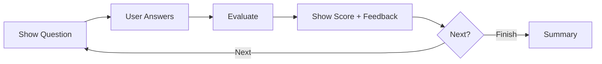
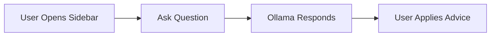

```md
# Product Requirements Document: AI Interview Preparation Bot (Hybrid) — MVP

## Executive Summary

**Product:** AI Interview Preparation Bot (Hybrid: DeepSeek/Groq + Ollama Assistant)  
**Version:** MVP (2.0)  
**Document Status:** Final  
**Last Updated:** 2026-05-08

### Product Vision
Provide a fast, accurate, and accessible interview preparation web app that generates role-specific interview questions from a Job Description (JD), conducts a structured mock interview, evaluates answers with professional feedback, and produces a downloadable PDF report. The app uses **cloud AI (DeepSeek or Groq)** for core intelligence and **local Ollama** for an always-available assistant chat to guide users during preparation.

### Success Criteria
- ≥95% successful question generation with valid structured output
- Median time to generate questions ≤15 seconds (internet + provider dependent)
- ≥98% completion of a full mock interview flow without errors
- 100% PDF download success on supported platforms
- User completes session (start → report) ≥80% in testing group

---

## Problem Statement

### Problem Definition
Most students and early-career job seekers prepare interviews using generic question banks and videos. These are not tailored to a specific JD and do not provide interactive evaluation. Paid coaching is expensive and inaccessible. There is a need for a personalized, automated solution that:
- Creates questions matching the exact JD and selected difficulty level
- Evaluates answers with structured, actionable feedback
- Produces a professional report for tracking improvement

### Impact Analysis
- **User Impact:** Reduced preparation time; improved confidence via targeted practice and feedback.
- **Market Impact:** High demand among campus placement candidates and entry-level job seekers seeking low-cost preparation tools.
- **Business/Portfolio Impact:** Strong academic/portfolio project demonstrating LLM integration, evaluation pipelines, and report generation.

---

## Target Audience

### Primary Persona: “Campus Placement Candidate”

**Demographics:**
- Age: 19–24
- Location: India (primary), global students (secondary)
- Education: BCA/BTech/MCA final year or recent graduate

**Psychographics:**
- Motivated to get placed; anxious about interviews
- Prefers fast, guided tools over long courses
- Values clear feedback and a measurable score

**Jobs to Be Done:**
1. **Functional:** Practice JD-relevant interview questions at chosen difficulty.
2. **Emotional:** Reduce anxiety by simulating a real interview.
3. **Social:** Improve performance for campus/company interviews and peer comparison.

**Current Solutions & Pain Points:**

| Current Solution | Pain Points | Our Advantage |
|---|---|---|
| YouTube/Blogs | Not personalized; no evaluation | JD-specific questions + scoring |
| Generic question banks | Irrelevant questions; no guidance | Context-aware generation |
| Paid coaching | Expensive, time-bound | Low cost; self-serve; repeatable |
| Friends/peers | Inconsistent feedback | Standard rubric-based evaluation |

### Secondary Personas
- **Career Switcher:** Wants targeted practice for new role; values gap analysis.
- **Working Professional:** Needs quick, high-quality mock interviews with feedback.

---

## User Stories

### Epic: JD-Based Mock Interview & Evaluation

**Primary User Story:**  
“As a job seeker, I want to paste/upload a job description and choose my knowledge level and question count so that I can get a tailored mock interview and a performance report.”

**Acceptance Criteria:**
- [ ] User can input JD via paste or file upload.
- [ ] User can choose knowledge level (Basic/Medium/Advanced).
- [ ] User can choose question count (8/10/12/15/20).
- [ ] System generates exactly that number of questions aligned to the JD.
- [ ] User can complete interview and download a PDF report.

### Supporting User Stories

1. “As a user, I want the app to evaluate each answer with score and improvement tips so that I know what to fix.”
   - **AC:** Each evaluated answer returns score (1–10), verdict, missing concepts, improvement tips, and ideal answer.

2. “As a user, I want to skip a question so that I can continue the mock interview without getting stuck.”
   - **AC:** Skip advances to next question and records status as skipped.

3. “As a user, I want an assistant chat inside the app so that I can ask follow-up questions while preparing.”
   - **AC:** Assistant chat is available throughout the session and can reference the current question when requested.

4. “As a user, I want to switch between DeepSeek and Groq so that I can use whichever is faster/available.”
   - **AC:** Provider can be selected in Settings and used for core tasks.

---

## Functional Requirements

### Core Features (MVP — P0)

#### Feature 1: JD Input (Paste/Upload)
- **Description:** User provides JD via text area or file upload (txt/pdf).
- **User Value:** Easy start; supports real JDs.
- **Business Value:** Increases adoption and usability.
- **Acceptance Criteria:**
  - [ ] Accepts paste input and file upload (txt/pdf).
  - [ ] Enforces max length (≤ 3000 words) with friendly error.
  - [ ] Rejects empty input.
- **Dependencies:** PDF text extraction library (if pdf supported), Streamlit file uploader.
- **Estimated Effort:** M

#### Feature 2: Knowledge Level + Question Count Controls
- **Description:** User selects level (Basic/Medium/Advanced) and question count (8/10/12/15/20).
- **User Value:** Matches skill level; controls session size/time.
- **Business Value:** Higher completion rate and satisfaction.
- **Acceptance Criteria:**
  - [ ] Level selection required before generating.
  - [ ] Question count selection required before generating.
  - [ ] Generated question count exactly matches selection.
- **Dependencies:** Prompt templates must include these constraints.
- **Estimated Effort:** S

#### Feature 3: JD Analyzer (Core AI)
- **Description:** Extract role, key skills, tech stack hints, and context from JD.
- **User Value:** Better question relevance.
- **Business Value:** Improves perceived intelligence and quality.
- **Acceptance Criteria:**
  - [ ] Produces structured analysis object (role, skills, seniority hints).
  - [ ] Handles messy JDs with reasonable outputs.
- **Dependencies:** DeepSeek/Groq API, JSON validation.
- **Estimated Effort:** M

#### Feature 4: Smart Question Generator (Core AI)
- **Description:** Generates interview questions aligned to JD + level + count; categorizes automatically.
- **User Value:** Personalized prep that feels “company/role specific.”
- **Business Value:** Differentiation vs generic tools.
- **Acceptance Criteria:**
  - [ ] Generates exactly N questions (N = selected count).
  - [ ] Each question includes category + difficulty tag (derived from chosen level).
  - [ ] Output is valid JSON conforming to schema.
- **Dependencies:** DeepSeek/Groq API, retry logic on invalid JSON.
- **Estimated Effort:** M

#### Feature 5: Mock Interview Engine
- **Description:** Presents questions sequentially; supports skip; tracks progress.
- **User Value:** Realistic practice flow.
- **Business Value:** Encourages full-session completion.
- **Acceptance Criteria:**
  - [ ] One question visible at a time.
  - [ ] Shows progress (e.g., 4/12).
  - [ ] Skip moves to next question and records it.
  - [ ] Restart clears session state.
- **Dependencies:** Streamlit session_state.
- **Estimated Effort:** M

#### Feature 6: Professional Answer Evaluation (Core AI)
- **Description:** Evaluates user answer per question with a rubric.
- **User Value:** Clear, actionable improvement guidance.
- **Business Value:** Core differentiator.
- **Acceptance Criteria:**
  - [ ] Returns score (1–10), verdict, feedback bullets, missing concepts, improvement tips, ideal answer.
  - [ ] Handles empty answer gracefully (low score + advice).
  - [ ] Output is valid JSON conforming to schema.
- **Dependencies:** DeepSeek/Groq API, strict prompting + validation.
- **Estimated Effort:** L

#### Feature 7: Final Summary & Readiness (Core AI)
- **Description:** Computes overall score (0–100), readiness label, strengths, gaps, 30-day plan.
- **User Value:** Clear decision-making and next steps.
- **Business Value:** Increases report value.
- **Acceptance Criteria:**
  - [ ] Generates overall score and readiness level.
  - [ ] Generates top recommendations (actionable).
- **Dependencies:** DeepSeek/Groq API.
- **Estimated Effort:** M

#### Feature 8: PDF Report Generator
- **Description:** Generates a professional downloadable PDF with all session data.
- **User Value:** Save/share/track improvement.
- **Business Value:** Portfolio-ready output.
- **Acceptance Criteria:**
  - [ ] PDF includes: JD summary, questions, answers, per-question evaluation, overall summary, improvement plan.
  - [ ] Download works on Windows/macOS/Linux.
- **Dependencies:** ReportLab, stable data structures.
- **Estimated Effort:** M

#### Feature 9: Assistant Bot (Local Ollama)
- **Description:** Sidebar chat for explanations and guidance; can optionally use current question context.
- **User Value:** On-demand help during practice.
- **Business Value:** Differentiates hybrid architecture.
- **Acceptance Criteria:**
  - [ ] Chat works independently of DeepSeek/Groq provider.
  - [ ] If Ollama unavailable, show friendly setup message.
- **Dependencies:** Ollama running locally; selected Ollama model installed.
- **Estimated Effort:** M

#### Feature 10: Provider Switch (DeepSeek / Groq)
- **Description:** Settings dropdown to choose provider used for core tasks.
- **User Value:** Reliability and speed control.
- **Business Value:** Reduced downtime risk.
- **Acceptance Criteria:**
  - [ ] User can select DeepSeek or Groq.
  - [ ] Provider selection persists for session.
  - [ ] API failures show retry + switch suggestion.
- **Dependencies:** Provider abstraction layer; `.env` keys.
- **Estimated Effort:** M

### Should Have (P1)
- Export session JSON
- Autosave/resume session locally
- “Regenerate questions” (same JD, same settings) with seed control

### Could Have (P2)
- Analytics dashboard (trend, weak areas)
- Resume upload + alignment scoring
- Multi-session history (local DB)

### Out of Scope (Won’t Have for MVP)
- User accounts/authentication
- Voice/video interviews
- Mobile app
- Cloud deployment + multi-tenant hosting
- Multilingual support

---

## Non-Functional Requirements

### Performance
- **Question Generation:** median ≤ 15s (provider/network dependent)
- **Per-Answer Evaluation:** median ≤ 10s
- **PDF Generation:** ≤ 5s
- **Timeout Handling:** configurable (default 60s) + retry/backoff

### Security
- **Authentication:** Not required for MVP
- **Secrets Management:** API keys only via `.env` (never printed/logged)
- **Data Protection:** No external storage by default; user data stays local except what is sent to AI provider for processing
- **Privacy Notice:** Inform user JD/answers are sent to selected provider (DeepSeek/Groq)

### Usability
- Simple, step-based UI; minimal configuration required
- Friendly errors (no raw tracebacks)
- Clear progress indicators and completion states

### Scalability
- Designed with provider abstraction to swap models/providers without refactor
- Stateless core where possible; state limited to session_state

---

## Quality Standards (Anti-Vibe Rules)

### Code Quality Requirements
- Modular architecture: providers, prompts, interview engine, PDF generator separated
- Strict schema validation on all LLM JSON outputs (no trusting raw output)
- Centralized error handling and user-safe messages
- Automated tests for critical paths (generation, evaluation, PDF)

### Design Quality Requirements
- Consistent design tokens (colors/typography) across UI
- Clear hierarchy and readability for long text answers/feedback

### What This Project Will NOT Accept
- Showing Python stack traces to end users
- Hardcoding API keys in code
- Proceeding with interview if questions JSON is invalid
- “Random” question counts not matching user selection

---

## UI/UX Requirements

### Design Principles
1. **Clarity over complexity:** step-by-step flow; one major action per screen.
2. **Readable long-form content:** answers and feedback must be easy to scan.
3. **Trust and professionalism:** consistent styling, structured evaluations, clean report.

### Style Guide (Theme, Typography, Layout)

**Theme Name:** Modern Professional (Clean, Trustworthy, Calm)

**Colors (Design Tokens)**
- Primary: `#4F46E5` (Indigo)
- Primary Dark: `#312E81`
- Success: `#10B981`
- Warning: `#F59E0B`
- Error: `#EF4444`
- Background: `#F8FAFC`
- Surface/Card: `#FFFFFF`
- Text: `#1E293B`
- Muted Text: `#64748B`
- Border: `#E2E8F0`

**Typography**
- Font: **Inter** (Google Fonts)
- H1: 32px, SemiBold
- H2: 24px, SemiBold
- Body: 16px, Regular
- Monospace: for “Ideal Answer” blocks only

**Layout**
- Max width: 1100px centered
- Sidebar: Assistant Bot (collapsible)
- Main: card-based sections with subtle borders/shadows
- Progress bar uses Primary color
- Verdict badges: Green/Amber/Red scale

**Streamlit theme config (`.streamlit/config.toml`)**
```toml
[theme]
primaryColor = "#4F46E5"
backgroundColor = "#F8FAFC"
secondaryBackgroundColor = "#FFFFFF"
textColor = "#1E293B"
font = "sans serif"
```

### Information Architecture
```
├── Home / Setup
│   ├── JD Input (paste/upload)
│   ├── Knowledge Level (Basic/Medium/Advanced)
│   ├── Question Count (8/10/12/15/20)
│   └── Provider Settings (DeepSeek/Groq)
├── Interview
│   ├── Question View (one at a time)
│   ├── Answer Input
│   ├── Skip / Next
│   └── Evaluation Panel
├── Summary & Report
│   ├── Overall Score + Readiness
│   ├── Strengths/Weaknesses
│   └── Download PDF
└── Sidebar
    └── Assistant Bot (Ollama)
```

### Key User Flows

#### Flow 1: Generate Interview


#### Flow 2: Mock Interview + Evaluation


#### Flow 3: Assistant Help (Anytime)


---

## Success Metrics

### North Star Metric
**Completed mock interview sessions with downloaded PDF report**

### OKRs for MVP (First 90 Days)
**Objective 1:** Deliver a stable, high-quality mock interview experience  
- **KR1:** ≥95% valid question generation outputs  
- **KR2:** ≥98% sessions complete without app crash  
- **KR3:** 100% PDF generation success rate

### Metrics Framework
| Category | Metric | Target | Measurement |
|---|---|---:|---|
| Activation | JD → Questions generated | ≥95% | App event logs (local) |
| Engagement | Avg. questions answered per session | ≥70% of generated | Session state summary |
| Quality | Avg. time to generate questions | ≤15s median | Timing logs |
| Reliability | Crash-free sessions | ≥98% | Manual test suite |
| Output | PDF download success | 100% | Manual + automated test |

---

## Constraints & Assumptions

### Constraints
- **Budget:** Minimal / student project (API usage may require credits)
- **Timeline:** 2–3 weeks build + testing
- **Resources:** Single developer
- **Technical:** Streamlit UI; DeepSeek/Groq APIs; Ollama installed locally for assistant

### Assumptions
- Users have stable internet for core features
- Users can install/run Ollama locally (optional; assistant degrades gracefully)
- DeepSeek/Groq keys available in `.env`

### Open Questions
- Should PDF include branding/logo and candidate name fields?
- Do we store session history locally by default or only per-session?

### Dependencies
- DeepSeek API availability and key
- Groq API availability and key
- Ollama installed + model pulled for assistant bot
- ReportLab for PDF creation

---

## Risk Assessment

| Risk | Probability | Impact | Mitigation |
|---|---|---|---|
| API rate limits / downtime | Med | High | Provider switch (DeepSeek/Groq), retries/backoff |
| Invalid JSON from LLM | Med | High | Strict schema validation + auto-retry with corrective prompt |
| Ollama not installed/running | Med | Med | Show setup guide; assistant optional |
| Increased API cost | Med | Med | Token limits, shorter prompts, caching, optional local fallback |
| Poor JD parsing for messy JDs | Low/Med | Med | Add prompt examples; allow user to edit extracted role/skills (P1) |

---

## MVP Definition of Done

### Feature Complete
- [ ] JD input (paste + upload) implemented
- [ ] Level + question count controls enforce constraints
- [ ] Provider switch DeepSeek/Groq working
- [ ] Question generation produces valid structured output (N questions)
- [ ] Mock interview flow (answer/skip/progress) complete
- [ ] Evaluation output structured and displayed clearly
- [ ] Summary generated with overall score + readiness
- [ ] PDF report generated and downloadable
- [ ] Ollama assistant chat available (with graceful failure handling)

### Quality Assurance
- [ ] Unit tests for: generation schema validation, evaluation schema validation, PDF generation
- [ ] Manual end-to-end run passes for both providers
- [ ] Friendly error handling for provider failure and Ollama failure

### Documentation
- [ ] README with setup, `.env` example, and troubleshooting
- [ ] Deployment guide: local run steps + Ollama setup
- [ ] Prompt templates documented

### Release Ready
- [ ] No secrets in repo
- [ ] Requirements pinned and installable
- [ ] Works on Windows (primary), plus basic check on macOS/Linux if possible
```